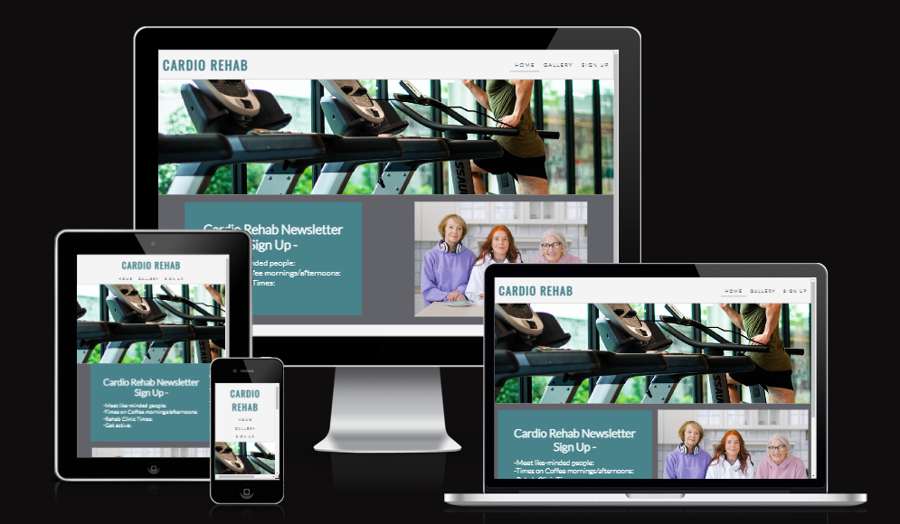
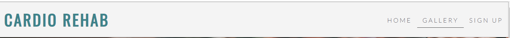
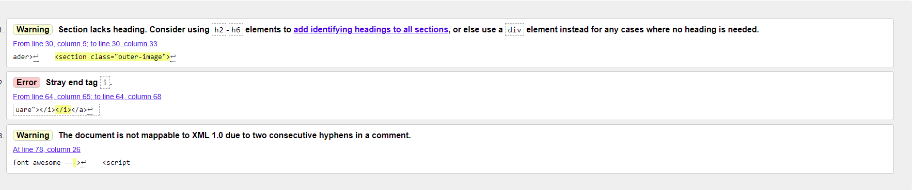
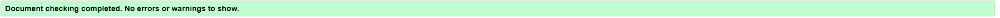
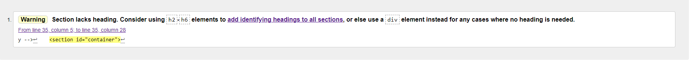
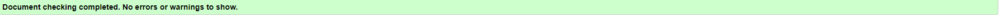
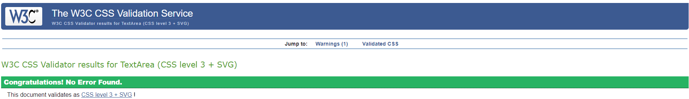
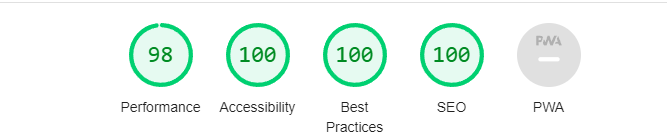

# Cardio Rehab - Sligo, Ireland

## The Cardio Rehab website is a site for people who have had Cardiac Health issues, and might be in need of encouragement to meet people for coffee and arrange for some form of exercise/physical rehabilitation.

- The site is simply where someone can sign-up for an information newsletter.
- The idea is not to PUSH a whole new lifestyle on anyone, simply to give people options.
- The newsletter shows people they are not alone and where to go to talk.
- The Cardio Rehab website also puts people in touch with Cardio-Rehab professionals.

## Users of this site who signup will be given information about physical rehab as well as meetings for like-minded people in a similar situation.
---

## Features
---
### The Header and Navigation

* Positioned at the top of the page is the Logo (Cardio Rehab) and the  navigation links to the other pages.
* The navigation links are: Home, Gallery & Video and Sign Up. Each of these links will take you to a new page.
* In order for the user to be aware what page they are on the current link is underlined. Also when the user hovers on a link it will chamge color.
* The navigation bar allows the user to quickly navigate between pages, and all pages have the same navigation bar to allow the user to traverse the site quickly and easily.

### The Hero Image and the Coffee image:

* The Hero image...
---
---
## Technologies Used:

---
---
## Testing and Validation:

* Cardio Rehab has been tested. All pages have been tested using WC3 HTML Validator and WC3 CSS Validator. The results are as below:
  * Home Page
  
      * These erors were easily remedied.
  
  * Gallery Page
  
      * The error that a section was without a 'heading' was deemed OK to remain.
  * Sign Up Page
  
  * WC3 CSS Validation:
  
  * Accessibility through Lighthouse in devtools:
  

  ---
  ---
  ## Deployment:

  ---
  ---
  ## Credits:

  ---
  ---
  ## Acknowledgements:

  ---
  ---