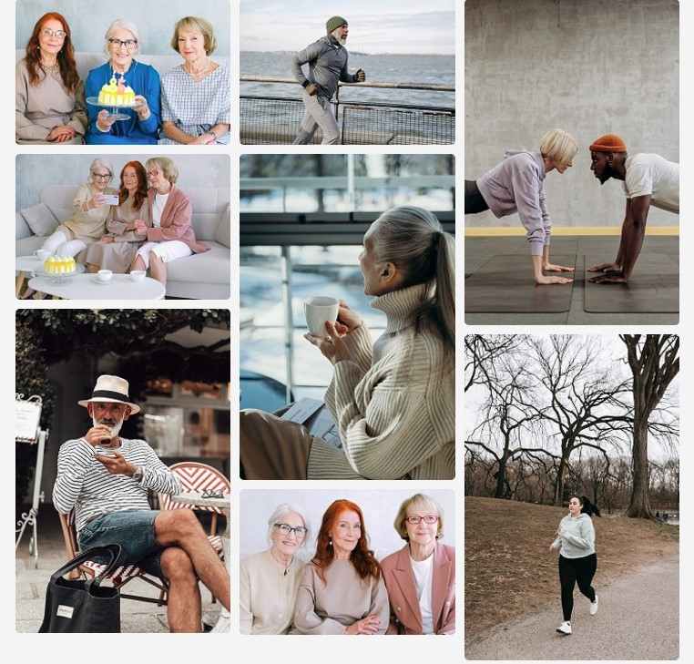
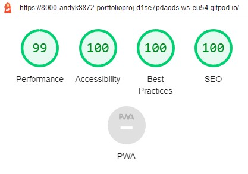

# Cardio Rehab - Sligo, Ireland

## The Cardio Rehab website is a site for people who have had Cardiac Health issues, and might be in need of encouragement to meet people for coffee and arrange for some form of exercise/physical rehabilitation.

- The site is simply where someone can sign-up for an information newsletter.
- The idea is not to PUSH a whole new lifestyle on anyone, simply to give people options.
- The newsletter shows people they are not alone and where to go to talk.
- The Cardio Rehab website also puts people in touch with Cardio-Rehab professionals.

## Users of this site who signup will be given information about physical rehab as well as meetings for like-minded people in a similar situation.
---

## User Experience Design
---
### User stories
#### First Time Visitor Goals
* As a First Time user, I want to easily understand the main purpose of the site andfind more information.
* As a First Time user, I want to be able to easily navigate throughout the site.
* As a First Time user, I want to view the website and content clearly any device.
* As a First Time user, I want to find ways to follow on different social media platforms.
#### Returning Visitor Goals
* As a Returning user, I want to contact Cardio Rehab so I can request more information.
#### Frequent Visitor Goals
* As a Frequent user, I want to check to see if there are any new events.
* As a Frequent user, I want to sign up to the Newsletter so that I am Emailed any major updates and/or changes Cardio Rehab times and meetings.
---
## Structure
* All Pages will contain a Navigation menu at the top of the Webpage that directs them to a new Page to easily allow users to Navigate the site easily.
* All Pages will contain a uniform font and color scheme to enable easy navigation.
* All pages will be responsive.
* All pages will be have the same navigation and footer so as to make it easier to navigate/undersand.
## Features
---
### The Header and Navigation (on all pages)

* Positioned at the top of the page is the Logo (Cardio Rehab) and the  navigation links to the other pages.
* The navigation links are: Home, Gallery & Video and Sign Up. Each of these links will take you to a new page.
* In order for the user to be aware what page they are on the current link is underlined. Also when the user hovers on a link it will change color.
* The navigation bar allows the user to quickly navigate between pages, and all pages have the same navigation bar to allow the user to traverse the site quickly and easily.

  

### The Hero Image:

* The Hero image's purpose is to immediately arrests a user's attention.

### The About Section:

* As a user I would like to know simply what the site is offering.

### The Footer Section/Social Media (on all pages)

* As a user I would like to be able to link to the assosiated social media links

### Video Section  

* As a user would I would like to get a preview of the exercise regime assosiated with Cardio Rehab.  

### Gallery Section  

* A selection of exercise photos and people meeting up and having coffee/tea etc.

  

### Signup Form  

* As a user I can signup to the newsletter.

   
---
## Testing and Validation:

* Cardio Rehab has been tested by the W3C CSS Validator and Nu Html Checker.
  * All pages have been tested using WC3 HTML Validator and WC3 CSS Validator. The there were no errors in the HTML code on any of the pages.
  

  * WC3 CSS Validation:
  

  * Accessibility through Lighthouse in devtools:
    (Accessibility through Lighthouse was 100% on all pages on all device sizes.)

    
  
---
## Technologies Used:
* HTML
	* This project uses HTML to complete the structure of the Website.
* CSS
	* This project uses CSS to style the Website.
* [Font Awesome](https://fontawesome.com/)
	* Font awesome Icons are used for the Social media links contained in the Footer section of the website.
* [Google Fonts](https://fonts.google.com/)
	* Google fonts are used throughout the project to import the *Lato* and *Oswald* fonts.
* [Visual Studio Code](https://code.visualstudio.com/)
	* VS Code via Gitpod is the Integrated Development Environment used to develop the Website.
* [GitHub](https://github.com/)
	* GithHub is the hosting site used to store the source code for the Website and [Git Pages](https://pages.github.com/) is used for the deployment of the live site.
* [Git](https://git-scm.com/)
	* Git is used as version control software to commit and push code to the GitHub repository where the source code is stored.
* [Google Chrome Developer Tools](https://developers.google.com/web/tools/chrome-devtools)
	* Google chromes built in developer tools are used to inspect page elements and help debug issues and test different CSS styles as well as test responsiveness.
* [MS PAINT](https://support.microsoft.com/en-us/windows/get-microsoft-paint)
  * The images were resized using mspaint.
* [Favicon](https://favicon.io/)
    * Favicon.io was used to make the site favicon 
* [Ami Responsive](https://ui.dev/amiresponsive)
    * Multi Device Website Mockup Generator was used to create the Mock up image in this README

---
  ## Deployment:
  ### Using Github Pages
  1. Navigate to the GitHub [Repository:](https://github.com/andyk8872/Portfolio-Project-1)
  1. Click the 'Settings' Tab.
  1. Goto the Git Hub Pages Heading.
  1. Select 'Main Branch' as the source.
  1. Click the Save button.
  1. Click on the link to go to the live deployed page. [Live Site:](https://andyk8872.github.io/Portfolio-Project-1/)

  ---
  ## Colors and Fonts:
  * 
  ---
  ## Credits:
  *  Pexels [All Images:](https://www.pexels.com/)
  *  Flexbox [Youtube tutorial for Flexbox-Nav-Bar:](https://www.youtube.com/watch?v=mh36Kts-wX8)
  *  Love Running project fro the Footer.
  *  Pixbay [Favicon Image](https://pixabay.com/)
  ---
  ## Acknowledgements:

  ---
  